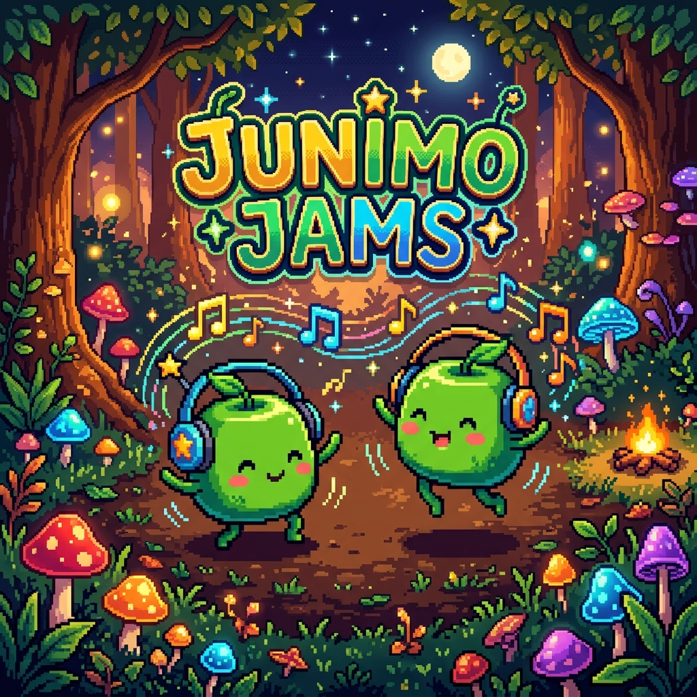

# 🌿 Junimo Jams



A premium, feature-rich **Stardew Valley** mod that adds a beautiful, modern music HUD overlay. It acts as a **Universal Media Hub** that tracks, controls, and displays details for almost any music player running on your system!

---

## 🆕 What's New in v5.2.0

- 🎶 **Universal YouTube Music Support** — Full cross-platform integration. Works with browser-based YouTube Music (Chrome, Safari, Edge, Firefox, Brave, Arc, Helium, and more) on Windows, macOS, and Linux, plus the official YouTube Music Desktop App.
- 🎵 **Massive Player Expansion** — Out-of-the-box support for **Spotify**, **iTunes**, **Apple Music**, **Amazon Music**, **TIDAL**, **Deezer**, **Cider**, **Plexamp**, **foobar2000**, **MusicBee**, **AIMP**, **Winamp**, **MediaMonkey**, **VLC**, and many more.
- 🗺️ **Hide On Map** — Automatically hides the HUD when the map or custom overlay menus are opened (fully compatible with *World Atlas* and other map-altering mods).
- 🎨 **Visual Polish** — Custom text shadow styling for readability on busy backgrounds, interactive button hover glow effects, and a cozy theme engine.
- ✨ **Smooth Transitions** — Beautiful, subtle fade-in animations whenever a track changes or state updates.
- 🎯 **Advanced Album Art Engine** — Uses a smart token-based Jaccard similarity matching algorithm to fetch correct artist metadata and high-resolution cover arts from the iTunes API.

---

## ✨ Features

### 1. 🎶 YouTube Music & Browser Tracking
Standard process window queries often cache web page titles (especially on Chrome and other Chromium browsers on Windows), causing track changes to go unnoticed. **Junimo Jams** fixes this by using platform-specific engines:
- **Windows**: Calls low-level APIs (`EnumWindows` and `GetWindowText`) to actively scan browser window titles in real time.
- **macOS**: Queries Safari, Chrome, Edge, and Brave using AppleScript scripts wrapped in safety checks to prevent closed browsers from launching.
- **Linux**: Queries browser players natively using the D-Bus MPRIS2 protocol.

### 2. 🔍 Smart Artist & Cover Art Matching
When tracking browser tabs or playing files with missing metadata, the track name might display as just `"Song Title"` (with no artist).
- **Junimo Jams** detects this generic state and queries the iTunes API using only the track title.
- It scores results using a **Jaccard token similarity** index.
- If a match scores above **0.85**, it automatically resolves the true artist name and downloads the corresponding **600x600 high-resolution album cover**.
- Results are saved in the local `cache/` folder (image files as `.png`, resolved artists as `.txt`) to ensure instant loading on subsequent plays with zero network overhead.

### 3. 🎮 In-Game Controls
Control your music directly inside the farm! Clicking the interactive buttons on the HUD triggers playback controls:
- **Windows**: Dispatches virtual media key events (`VK_MEDIA_PLAY_PAUSE`, `VK_MEDIA_NEXT_TRACK`, `VK_MEDIA_PREV_TRACK`).
- **macOS**: Issues AppleScript commands directly to active players.
- **Linux**: Sends D-Bus MPRIS2 control messages (`PlayPause`, `Next`, `Previous`) to active player processes.

### 4. 🔠 Character Normalization
Normalizes Turkish (`ı`, `ş`, `ğ`, `ç`, `ö`, `ü`), Cyrillic, and other special characters to prevent broken boxes and formatting errors in standard Stardew Valley game fonts.

---

## 🎧 Supported Music Players

| Category | Supported Players | Windows | macOS | Linux |
|---|---|:---:|:---:|:---:|
| **Streaming** | **Spotify**, **Apple Music / iTunes**, **Amazon Music** | ✅ | ✅ | ✅ |
| **YouTube Music** | Browser Tabs (Chrome, Edge, Firefox, Brave, Safari, Arc, Helium) | ✅ | ✅ | ✅ |
| **Desktop App** | Official YouTube Music Desktop App | ✅ | — | — |
| **High-Fidelity** | **TIDAL**, **Deezer**, **Cider**, **Plexamp** | ✅ | ✅ | ✅ |
| **Media Players** | **foobar2000**, **MusicBee**, **AIMP**, **Winamp**, **MediaMonkey**, **VLC** | ✅ | — | — |
| **Custom** | Any custom process name specified in `ExtraPlayers` | ✅ | ✅ | ✅ |

> 💡 **Tip:** On Linux, any player conforming to the MPRIS2 D-Bus standard is auto-detected. On Windows/macOS, you can add custom process names using the `ExtraPlayers` setting in `config.json`.

---

## 📥 Installation

1. Download and install the latest version of [SMAPI](https://smapi.io/).
2. Download **Junimo Jams** from [Nexus Mods](https://www.nexusmods.com/stardewvalley/mods/38791) and extract it into your `Stardew Valley/Mods` folder.
3. *(Highly Recommended)* Install [Generic Mod Config Menu](https://www.nexusmods.com/stardewvalley/mods/5098) to configure settings in-game.
4. Launch the game, open your favorite player, and start listening!

---

## ⚙️ Configuration

Configure the mod using **Generic Mod Config Menu** in the game, or edit the `config.json` file manually:

| Setting | Default | Description |
|---|---|---|
| `ShowHud` | `true` | Toggle the entire HUD overlay. |
| `HudPositionX` | `20` | Horizontal coordinate of the HUD (in pixels). |
| `HudPositionY` | `20` | Vertical coordinate of the HUD (in pixels). |
| `HudScale` | `1.0` | Scale factor (from `0.5` up to `2.0`). |
| `OnlyShowInInventory` | `false` | When true, the HUD only displays inside your inventory screen. |
| `HideOnMap` | `true` | When true, automatically hides the HUD when opening the map or non-inventory menus. |
| `Theme` | `"default"` | Visual skin. Point to any folder containing theme assets inside `assets/`. |
| `ShowAlbumArt` | `true` | Toggle displaying album cover art. |
| `ShowPlaybackButtons` | `true` | Toggle displaying play, pause, next, and previous buttons. |
| `ExtraPlayers` | `[]` | List of additional process names to track (e.g. `["MyPlayer", "Foobar"]`). |

---

## 🎨 Themes

Junimo Jams is designed with custom themes in mind! A theme consists of a folder inside the `assets/` directory containing the following elements:
- `background.png` (400x150 px): The frame overlay.
- `btn_play.png`, `btn_pause.png`, `btn_next.png`, `btn_prev.png` (128x128 px): Button assets.

For more details on coordinate systems, color keys, and customizing labels, refer to the [THEME_SPEC.md](JunimoJams/assets/THEME_SPEC.md) file.

---

## 🛠️ Development

Built with **C#** targeting **.NET 6** and the **SMAPI SDK**.

### Compiling From Source:
1. Clone this repository.
2. Open `JunimoJams.sln` using Visual Studio, JetBrains Rider, or VS Code.
3. Build the project using the IDE or command line:
   ```bash
   dotnet build
   ```
4. Build configurations automatically detect your Stardew Valley installation and place the compiled files directly in the `Mods` folder.

---

## 📜 Credits

- Mod design and implementation by **MehmetCanWT**.
- Built on top of the wonderful [SMAPI modding API](https://smapi.io/).

---

*Stardew Valley is a trademark of ConcernedApe LLC. This mod is an independent project and is not affiliated with ConcernedApe, Spotify, Apple, Google, or any other music streaming service.*
